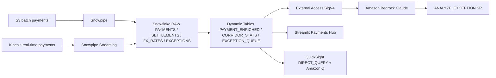

# Singapore Cross-Border Payments Hub

Real-time cross-border payment processing and settlement monitoring for Singapore corridors (FAST, PayNow, SWIFT, GIRO) — powered by Snowflake Dynamic Tables and Amazon Bedrock for intelligent exception resolution.

## Architecture

A Singapore cross-border payments hub built on **Snowflake** (Snowpipe / Streaming, Dynamic Tables, External Access) and **AWS** (S3, Kinesis, Bedrock Claude, QuickSight + Amazon Q). Payments arrive via Kinesis or S3; Snowflake enriches with FX and SLA; Bedrock investigates exceptions; QuickSight serves the operations dashboard.



## Personas

| Persona | Role | Key Questions |
|---------|------|---------------|
| **Payments Ops Analyst** | Real-time monitoring and exception handling | "Which payments are breaching SLA?" "What's causing the AML hold on this transaction?" |
| **CFO / CRO** | Risk and revenue oversight | "What's our volume by corridor?" "What's the exception rate trend?" |

## Data

| Table | Rows | Description |
|-------|------|-------------|
| PAYMENTS_RAW | 500 | 6 corridors, 4 payment types, 5 sender banks |
| SETTLEMENTS_RAW | 500 | 450 cleared, 30 pending, 20 failed |
| FX_RATES_RAW | 100 | SGD/MYR, SGD/IDR, SGD/THB, SGD/HKD, SGD/PHP |
| EXCEPTIONS_RAW | 40 | AML holds, sanctions hits, format errors, timeouts |

## Build Instructions

### Prerequisites
- Snowflake account with ACCOUNTADMIN access
- Cortex AI enabled (ML Functions, Search, Agent)
- Warehouse: CORTEX (Medium)
- AWS CLI with Bedrock access (us-west-2)

### Deployment

```bash
snowsql -f snowflake/00_setup.sql
snowsql -f snowflake/01_integrations.sql
snowsql -f snowflake/02_raw_tables.sql
```

### Streamlit App
```
FSI_PAYMENTS.APP.PAYMENTS_HUB_APP
```

## Key Demo Numbers

- **6 payment corridors** (SG-SG, SG-MY, SG-ID, SG-TH, SG-HK, SG-PH)
- **4 payment types** — FAST (15min SLA), PayNow (5min), SWIFT (4h), GIRO (24h)
- **~26 open exceptions** — AML holds, sanctions hits, format errors
- **Bedrock Claude** analyzes exceptions and recommends resolution actions

## License

Apache 2.0 — See [LICENSE](LICENSE) for details.
