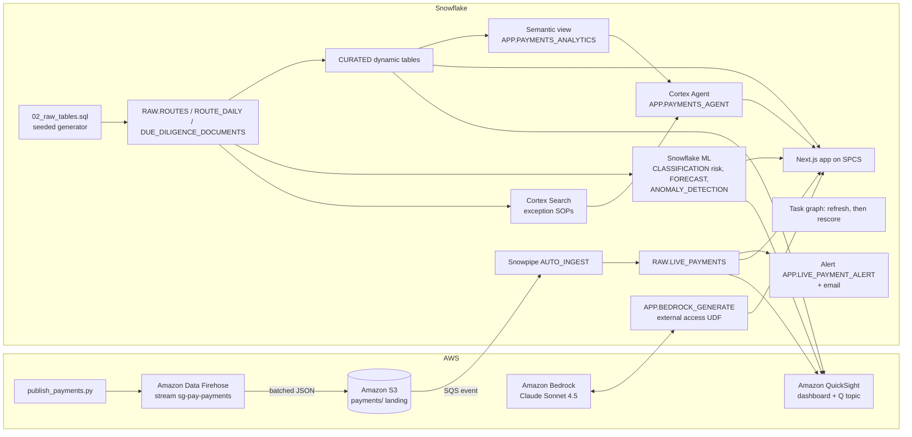

# Singapore Cross-Border Payments Hub - Exceptions and Settlement Operations

End-to-end payments operations for **40 payment routes from a fictional Singapore payments hub into 5 corridors** (Malaysia, Hong Kong, Indonesia, Thailand, Philippines) using Snowflake, optionally with AWS: from a live payment exception to a 7-day payment-failure risk score, an alert email and an AI action memo for the payments operations team.

## Architecture

A payments-operations pipeline built on **Snowflake** (Dynamic Tables, Snowflake ML, Cortex Search, Cortex Agent, Cortex AI_COMPLETE, SPCS) and, in the full build, **AWS** (Amazon Data Firehose, S3, Bedrock Claude, QuickSight + Amazon Q). Payment events land in `RAW.LIVE_PAYMENTS`. Dynamic tables curate 90 days of route-day history: payments processed, exceptions raised, failed payments, SLA breaches, straight-through rate and nostro reconciliation compliance. Snowflake ML scores 7-day payment-failure risk per route, forecasts hub-wide exception volume and flags screening hit rate anomalies. A Cortex Agent answers questions with SOP citations, and an LLM drafts the operations action memo.

Interactive diagrams (hover for object names): [Snowflake only](docs/architecture-snowflake.html) | [AWS + Snowflake](docs/architecture-aws.html). The app shows both on its Architecture & Data tab, the current build first. Regenerate them with `python3 docs/build_architecture.py`.


```mermaid
flowchart LR
    subgraph AWS
      SIM[publish_payments.py] --> FH[Amazon Data Firehose<br/>stream sg-pay-payments]
      FH -->|batched JSON| S3[(Amazon S3<br/>payments/ landing)]
      BR[Amazon Bedrock<br/>Claude Sonnet 4.5]
      QS[Amazon QuickSight<br/>dashboard + Q topic]
    end
    subgraph Snowflake
      S3 -->|SQS event| PIPE[Snowpipe AUTO_INGEST] --> LIVE[RAW.LIVE_PAYMENTS]
      GEN[02_raw_tables.sql<br/>seeded generator] --> RAW[RAW.ROUTES / ROUTE_DAILY / DUE_DILIGENCE_DOCUMENTS]
      RAW --> DT[CURATED dynamic tables]
      RAW --> ML[Snowflake ML<br/>CLASSIFICATION risk, FORECAST,<br/>ANOMALY_DETECTION]
      DT --> SV[Semantic view<br/>APP.PAYMENTS_ANALYTICS]
      RAW --> CS[Cortex Search<br/>exception SOPs]
      SV --> AG[Cortex Agent<br/>APP.PAYMENTS_AGENT]
      CS --> AG
      LIVE --> AL[Alert APP.LIVE_PAYMENT_ALERT<br/>+ email]
      UDF[APP.BEDROCK_GENERATE<br/>external access UDF]
      TK[Task graph: refresh, then rescore]
      APP[Next.js app on SPCS]
    end
    BR <--> UDF
    DT --> APP
    ML --> APP
    LIVE --> APP
    AG --> APP
    UDF --> APP
    DT --> QS
    ML --> QS
    LIVE --> QS
```

The Snowflake-only build drops the AWS subgraph: `APP.SIMULATE_PAYMENTS` writes to `RAW.LIVE_PAYMENTS`, and the app calls Cortex `AI_COMPLETE` instead of the Bedrock UDF.

## Snowflake Capabilities

| Capability | Implementation |
|-----------|---------------|
| Dynamic Tables | `CURATED.KPI_SUMMARY`, `PERFORMANCE_SUMMARY`, `EXCEPTION_SUMMARY`, `TREND_ANALYSIS` from the RAW tables |
| Snowflake ML | CLASSIFICATION 7-day payment-failure risk (`ML.FAILURE_RISK_SCORES`), 14-day exception-volume FORECAST, screening hit rate ANOMALY_DETECTION |
| Cortex Search | 14 synthetic exception-handling SOPs (one per payment segment and exception type) in `SEARCH.EXCEPTION_SOP_SEARCH` |
| Semantic View | `APP.PAYMENTS_ANALYTICS` over routes, exception types, daily totals and risk |
| Cortex Agent | `APP.PAYMENTS_AGENT`: Cortex Analyst over the semantic view plus Cortex Search for SOP citations |
| Cortex AI | `AI_COMPLETE('claude-sonnet-4-5')` for grounded answers, and for the action memo in the Snowflake-only build |
| Alerts + Tasks | `APP.LIVE_PAYMENT_ALERT` logs EXCEPTION events and sends email; task graph `TASK_REFRESH_CURATED`, then `TASK_RESCORE_RISK` |
| Snowpark Container Services | Next.js app `APP.SG_PAY_APP` with 6 tabs: Executive Cockpit, Predictive, Controls, Live Payments, Ask AI, Architecture & Data |
| Snowpipe | `RAW.LIVE_PAYMENTS_PIPE` AUTO_INGEST from S3 (AWS build only) |

## AWS Services

Used only in the AWS + Snowflake build.

| Service | Role in Demo |
|---------|-------------|
| Amazon Data Firehose | Direct PUT stream `sg-pay-payments` receives simulated payment events and writes batches to S3 |
| Amazon S3 | Landing bucket (`payments/`). An event notification goes to the Snowpipe SQS queue |
| Amazon Bedrock | Claude Sonnet 4.5 writes the action memo, called from Snowflake through an external-access UDF |
| Amazon QuickSight | DIRECT_QUERY executive dashboard over Snowflake (daily exceptions, failed payments by route, payment-failure risk) |
| Amazon Q | Natural-language questions over the QuickSight topic `sg-pay-topic` |
| AWS IAM | Least-privilege roles for S3, Firehose and Bedrock |

## Personas

These personas are fictional.

| Persona | Role | Key Questions |
|---------|------|---------------|
| **Rachel Tan** | Head of Payments Operations | "What is our straight-through rate?" "Which exception types turn into failed payments?" |
| **Marcus Lee** | Payments Exceptions Analyst | "Which routes are high risk this week, and which SOP applies?" |

## Data

All data is synthetic and seeded, so every rebuild reproduces it. The payments hub, routes and names are fictional.

| Table | Rows | Description |
|-------|------|-------------|
| RAW.ROUTES | 40 | Payment routes from Singapore into 5 corridors and 5 segments (Retail remittance, SME trade, Payroll batch, Corporate treasury, Bank-to-bank), with correspondent risk tier |
| RAW.ROUTE_DAILY | 3,600 | Daily route observations over 90 days: payments, value (SGD), exceptions, failed payments, SLA breaches, exception type, nostro reconciliation, screening hit rate and settlement time |
| RAW.DUE_DILIGENCE_DOCUMENTS | 40 | Required, on-file and pending correspondent due-diligence documents per route |
| SEARCH.EXCEPTION_DOCS | 14 | Synthetic exception-handling SOPs indexed for Cortex Search |
| RAW.LIVE_PAYMENTS | Grows during the demo | Live payment events from Firehose (AWS build) or `APP.SIMULATE_PAYMENTS` (Snowflake-only build) |
| ML.FAILURE_RISK_SCORES | 40 | 7-day payment-failure probability and risk band per route |

## Build Instructions

### Prerequisites
- Snowflake account with ACCOUNTADMIN access, and Cortex AI enabled (AI_COMPLETE, Search, Agent).
- An X-Small warehouse with auto-suspend at or below 120 s, and an existing SPCS compute pool.
- Python 3.11+, `snowflake-connector-python`, Node.js 22+, Docker and the `snow` CLI.
- App image: run `snow spcs image-registry login`, then build and push `sg-pay-app:v1` to the database's `APP.IMAGES` repository (see the header of `snowflake/07_deploy_app.sql`).
- AWS build only: `boto3`, AWS credentials for the target account (us-west-2) with Bedrock access, and QuickSight Enterprise.

### SPCS App
```
<DATABASE>.APP.SG_PAY_APP
```

### Tests
```bash
python -m pytest aws snowflake quicksight
```

For a local run, put `SNOWFLAKE_ACCOUNT`, `SNOWFLAKE_USER`, `SNOWFLAKE_DATABASE`, `SNOWFLAKE_WAREHOUSE`, `SNOWFLAKE_AUTHENTICATOR=PROGRAMMATIC_ACCESS_TOKEN`, `SNOWFLAKE_TOKEN` and `DEMO_PLATFORM` in the environment, then run `npm --prefix app run build && npm --prefix app start`.

## Build Modes

Both modes share the same core. They differ in three places, and the app's `DEMO_PLATFORM` setting (in its SPCS spec) switches the memo provider and the Live Payments tab.

| Layer | Snowflake Only | Full AWS + Snowflake |
|---|---|---|
| Live payments | `CALL APP.SIMULATE_PAYMENTS(n)` inserts simulated payment events into `RAW.LIVE_PAYMENTS`. This simulates a payment feed; it is not Snowpipe Streaming | `aws/publish_payments.py` to Amazon Data Firehose, then S3, SQS and Snowpipe AUTO_INGEST |
| Action memo | Cortex `AI_COMPLETE('claude-sonnet-4-5')` | Amazon Bedrock Claude Sonnet 4.5 through `APP.BEDROCK_GENERATE` |
| BI and natural-language questions | The SPCS app is the dashboard; questions go to the Cortex Agent | Also a QuickSight dashboard and an Amazon Q topic |
| App setting | `DEMO_PLATFORM: snowflake` | `DEMO_PLATFORM: aws` |

### Snowflake Only

```bash
# 1. Core data and dynamic tables (guarded: new isolated database only)
python snowflake/run_core.py --database SINGAPORE_PAYMENTS_SNOWFLAKE --warehouse <XS_WAREHOUSE> --connection <CONNECTION> --apply
# 2. Native payment feed, ML, search, semantic view, agent, alert and task graph
python snowflake/run_intelligence.py --database SINGAPORE_PAYMENTS_SNOWFLAKE --platform snowflake --warehouse <XS_WAREHOUSE> --connection <CONNECTION> --alert-email you@example.com
# 3. App on SPCS with DEMO_PLATFORM=snowflake (push the image first)
python snowflake/run_intelligence.py --database SINGAPORE_PAYMENTS_SNOWFLAKE --platform snowflake --warehouse <XS_WAREHOUSE> --connection <CONNECTION> --alert-email you@example.com --files 07_deploy_app.sql --compute-pool <COMPUTE_POOL>
```

During the demo:
- Run `CALL APP.SIMULATE_PAYMENTS(20)` to add live payment events. For a continuous feed, run `ALTER TASK APP.TASK_SIMULATE_PAYMENTS RESUME`, and `SUSPEND` it afterwards.
- Run `EXECUTE ALERT APP.LIVE_PAYMENT_ALERT` to raise the alert email.
- Run `EXECUTE TASK APP.TASK_REFRESH_CURATED` to refresh the curated tables and rescore risk.

Afterwards, drop the database or run `ALTER SERVICE APP.SG_PAY_APP SUSPEND`.

### Full AWS + Snowflake

```bash
# 1. Core data and dynamic tables (guarded: new isolated database only)
python snowflake/run_core.py --database SINGAPORE_PAYMENTS_AWS --warehouse <XS_WAREHOUSE> --connection <CONNECTION> --apply
# 2. AWS ingestion and Bedrock (dry run first, then --apply)
python aws/setup_aws.py --database SINGAPORE_PAYMENTS_AWS --account <AWS_ACCOUNT_ID> --connection <CONNECTION> --apply
# 3. ML, search, semantic view, agent, alert and task graph
python snowflake/run_intelligence.py --database SINGAPORE_PAYMENTS_AWS --platform aws --warehouse <XS_WAREHOUSE> --connection <CONNECTION> --alert-email you@example.com
# 4. App on SPCS with DEMO_PLATFORM=aws (push the image first)
python snowflake/run_intelligence.py --database SINGAPORE_PAYMENTS_AWS --platform aws --warehouse <XS_WAREHOUSE> --connection <CONNECTION> --alert-email you@example.com --files 07_deploy_app.sql --compute-pool <COMPUTE_POOL>
# 5. QuickSight dashboard and Q topic (needs an existing Snowflake data source)
python quicksight/build_dashboards.py --database SINGAPORE_PAYMENTS_AWS --account <AWS_ACCOUNT_ID> --principal-arn <QUICKSIGHT_USER_ARN> --data-source-arn <DATA_SOURCE_ARN> --prefix sg-pay --apply --update --with-topic
```

QuickSight objects must be shared with the QuickSight user who signs in (`--principal-arn`); otherwise the console shows nothing.

During the demo:
- Run `python aws/publish_payments.py --count 20` to send live payment events. Firehose buffers for up to 60 seconds before writing to S3.
- Run `EXECUTE ALERT APP.LIVE_PAYMENT_ALERT` to raise the alert email.
- Run `EXECUTE TASK APP.TASK_REFRESH_CURATED` to refresh the curated tables and rescore risk.

Afterwards, `python aws/teardown_aws.py --database SINGAPORE_PAYMENTS_AWS --account <AWS_ACCOUNT_ID> --connection <CONNECTION> --apply` removes the AWS resources and the account-level Bedrock external-access and S3 storage integrations. It leaves the email integration `SG_PAY_EMAIL_INT`, which the Snowflake-only build also uses.

## Business Impact

Industry research and Snowflake customer outcomes:
- **Speed target for cross-border retail payments**: the G20 targets call for 75% of cross-border retail payments to provide availability of funds for the recipient within one hour from the time the payment is initiated, and for the remainder of the market within one business day, by end-2027 -- [FSB, Targets for addressing the four challenges of cross-border payments: Final report (2021)](https://www.fsb.org/uploads/P131021-2.pdf)
- **Remittance cost target**: the same report reaffirms the UN SDG that the global average cost of sending a $200 remittance be no more than 3% by 2030, with no corridors with costs higher than 5% -- [FSB, Targets for addressing the four challenges of cross-border payments: Final report (2021)](https://www.fsb.org/uploads/P131021-2.pdf)
- **Western Union** (Snowflake customer), which helps people and businesses move money, "Reduces Costs 50% And Achieves Multi-Cloud Strategy With Snowflake" -- [Snowflake customer story: Western Union](https://www.snowflake.com/en/customers/all-customers/case-study/western-union/)

## Key Demo Numbers

These figures are synthetic and come from the seeded demo data. Forecast and anomaly figures can shift slightly with the build day.

- **40 routes** from Singapore, 3,600 route-days over 90 days, into 5 corridors across 5 segments; **1,194,810 payments** worth SGD 14,133 M
- **Straight-through rate 99.96%**: **531 exceptions** raised, of which **160** ended as failed payments (exception failure rate 30.1%); **80 SLA breaches**
- **AML holds** produce the most failed payments (44 of 116 exceptions); the 16 clearing system outage exceptions always clear without failure
- **Payment-failure model** out-of-time holdout: precision 0.40, recall 0.23 at a 0.5 threshold, against a 0.21 base rate. Seven routes are high risk; the top route is RTE-0013, at 84.2%
- **14-day exception forecast** with prediction intervals; **48 of 640** route-days flagged as screening hit rate anomalies
- **Nostro reconciliation compliance 79.9%**, due-diligence document coverage 57.1%, with 21 documents pending
- **14 SOPs** indexed for Cortex Search and cited by ID in agent answers

## License

Apache 2.0 — See [LICENSE](LICENSE) for details.

This is a personal demo project and is not an official Snowflake offering. It comes with no support or warranty. Industry metrics cited are from publicly available third-party research and Snowflake customer stories; they represent reported outcomes and are not guarantees of results.
